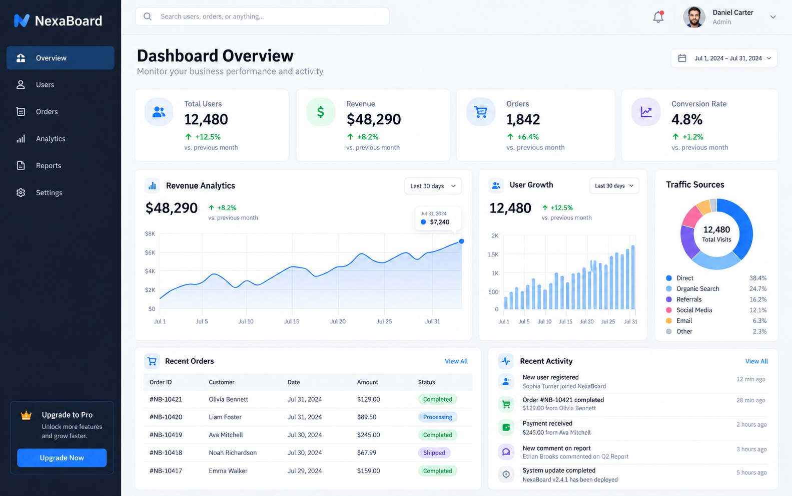
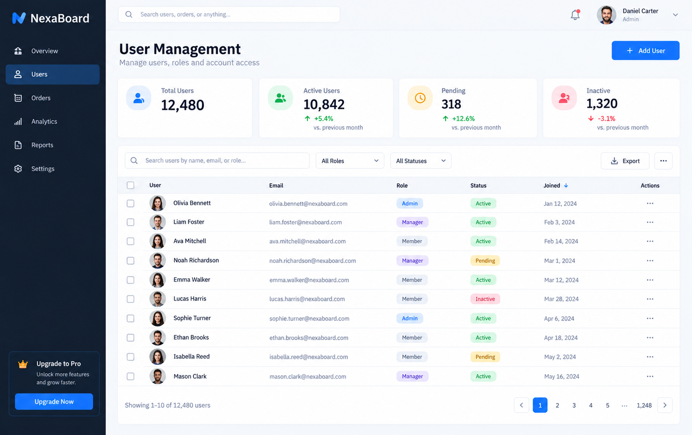
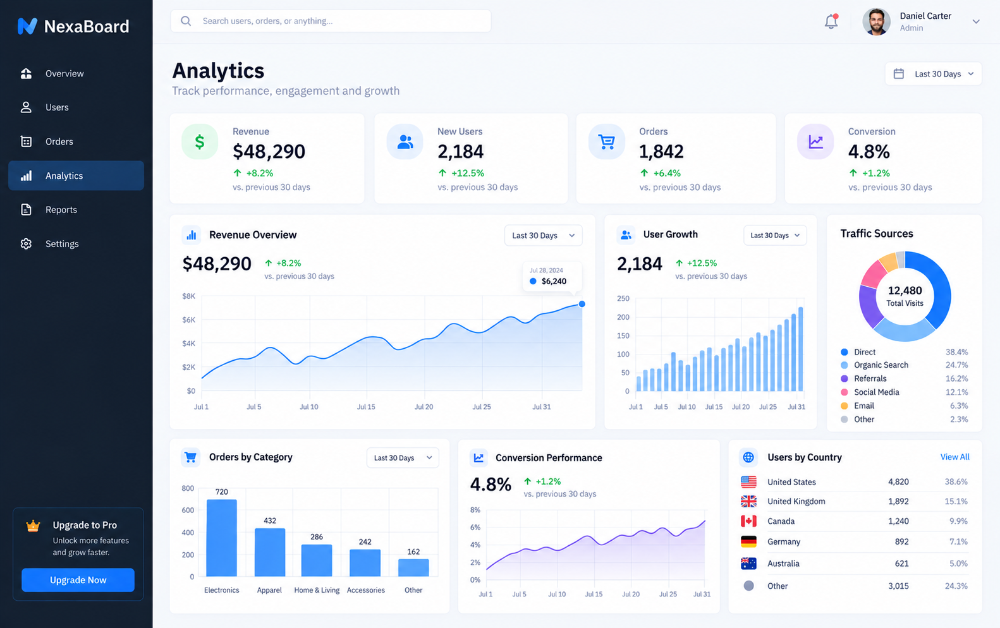

# React Admin Dashboard

A modern admin dashboard concept built with React, designed to showcase clean dashboard interfaces, analytics, user management, and reusable application components.

## Overview

This project demonstrates a responsive admin interface suitable for SaaS platforms, business applications, internal tools, and management systems.

The dashboard focuses on presenting important business information through a clean, structured, and easy-to-use interface.

## Dashboard Preview

### Dashboard Overview

### User Management

### Analytics Dashboard

## Features

- Dashboard overview with key business metrics
- KPI and statistics cards
- Revenue and order insights
- User management interface
- Search and filtering
- Analytics and data visualization
- Recent activity tracking
- Responsive dashboard layout
- Reusable React components
- Clean and modern admin interface

## Tech Stack

- React.js
- JavaScript
- HTML5
- CSS3

## Sample Component

The repository includes a sample `Dashboard.jsx` component demonstrating a reusable dashboard structure with statistics cards, business metrics, and recent activity.

## Use Cases

This dashboard concept can be adapted for:

- SaaS applications
- Admin portals
- CRM systems
- E-commerce management
- Business intelligence dashboards
- Internal management tools

## Project Purpose

This is an independent demonstration project created to showcase frontend development, dashboard UI patterns, and React component structure.

The project uses fictional data and is not based on or connected to any confidential client project.

---

**Built by Sumit Kumar**  
Full-Stack Developer | React • Next.js • Node.js • APIs & AI Integrations
